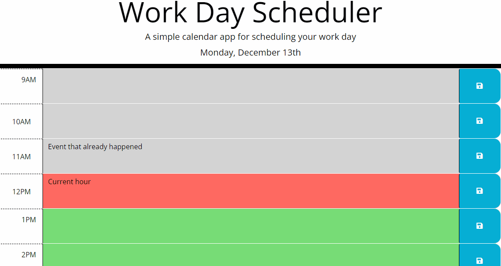

# work-day-scheduler

  ## Description
  Daily calendar to track and schedule tasks.
  ## Screenshot
()
  ## Table of Contents
  * [Features](#features)
  * [Languages & Dependencies](#languagesanddependencies)
  * [Usage](#Usage)
  * [Contributors](#contributors)
  * [Testing](#testing)
  * [Questions](#questions)
  ## Features
  Saves each day to local storage. Broken up by hour for a (9-5) workday. Color-coded time slots let you know if each hour is in the past, present, or future.
  ## Languages & Dependencies
  N/A
  ## Usage:
  HTML, JavaScript, CSS
  ## Contributors
  N/A
  ## Testing
  N/A
 